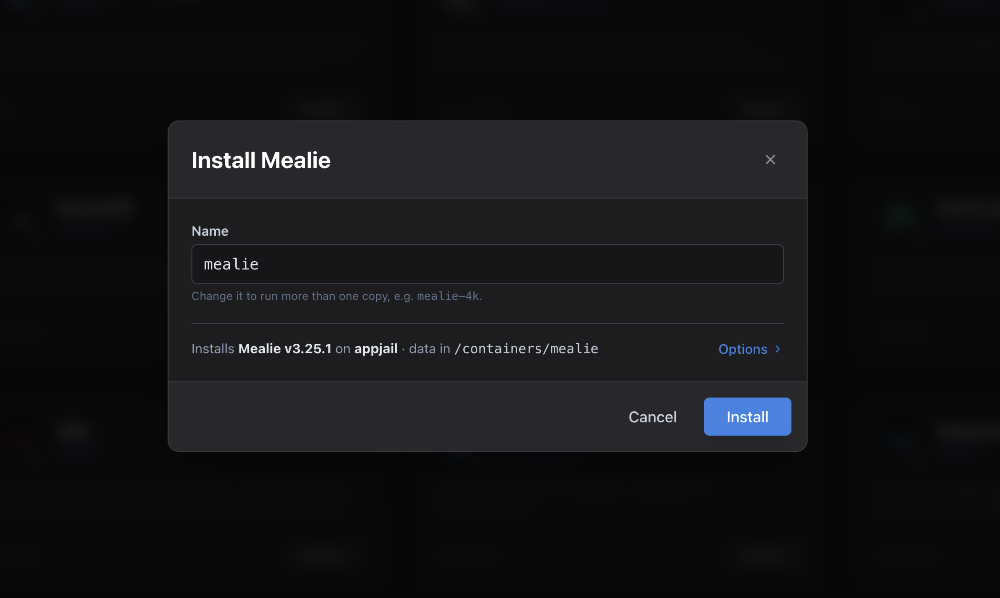

<div class="hero">
  <div class="hero-content">
    <div class="hero-logo">
      
    </div>
    <h1><span class="fj-f">f</span>jord</h1>
    <p class="hero-subtitle">FreeBSD Jail Orchestration Runtime Descriptor</p>
    <p class="hero-tagline">An open, vendor-neutral standard and native compose platform for FreeBSD. Deploy OCI container stacks directly as native jails with Podman or AppJail—zero VM overhead, zero proprietary appliance lock-in.</p>
    <div class="hero-buttons">
      <a href="install/" class="md-button md-button--primary">Get Started</a>
      <a href="spec/" class="md-button">Read the Spec</a>
      <a href="concepts/" class="md-button">Explore Architecture</a>
      <a href="https://daemonless.io/images/" class="md-button">Browse 80+ Apps</a>
    </div>
  </div>
  <div class="window-frame">
    <div class="window-header">
      <span class="window-dot red"></span>
      <span class="window-dot yellow"></span>
      <span class="window-dot green"></span>
      <span class="window-title">fjord — app store</span>
    </div>
    <a href="img/store.png" class="glightbox">
      
    </a>
  </div>
</div>

<div class="fj-section fj-head">
  <h2>Up and running in a minute</h2>
  <p class="section-desc">One static binary plus an rc script. The port also pulls in the whole podman toolchain; the other two assume the host is set up per the <a href="https://daemonless.io/guides/quick-start/">daemonless Getting Started</a> guide.</p>
</div>

<div class="fj-install-tabs" markdown>

=== "Release binary"

    ```sh
    fetch https://github.com/daemonless/fjord/releases/latest/download/fjordd
    fetch https://raw.githubusercontent.com/daemonless/fjord/main/packaging/fjordd.rc
    install -m 755 fjordd /usr/local/sbin/fjordd
    install -m 755 fjordd.rc /usr/local/etc/rc.d/fjordd

    sysrc fjordd_enable=YES && service fjordd start    # then open http://<host>:3567
    ```

=== "Port"

    ```sh
    pkg install -y git podman sysutils/podman-compose catatonit conmon ocijail   # the engine, from packages
    git clone https://github.com/daemonless/freebsd-ports
    cd freebsd-ports/sysutils/fjord && make install clean

    sysrc fjordd_enable=YES && service fjordd start    # then open http://<host>:3567
    ```

    The port installs `fjordd` and its rc script and depends on the podman toolchain — installing that from packages first means `make` only builds fjord. Add `pkg install -y appjail sysutils/py-director` for the AppJail engine.

=== "git clone"

    ```sh
    pkg install -y git go npm
    git clone https://github.com/daemonless/fjord && cd fjord
    (cd ui && npm ci && npm run build) && go build -o fjordd ./cmd/fjordd
    install -m 755 fjordd /usr/local/sbin/fjordd
    install -m 755 packaging/fjordd.rc /usr/local/etc/rc.d/fjordd

    sysrc fjordd_enable=YES && service fjordd start    # then open http://<host>:3567
    ```

</div>

<div class="fj-section">
  <h2>A Horizontal Standard, Not a Vertical Appliance</h2>
  <p class="section-desc">Linux homelab ecosystems achieved "one-click" app stores by building vertical silos—appliances like CasaOS and TrueNAS SCALE deliver convenience by locking the user into a proprietary operating system, a captive UI, and an opinionated orchestrator.</p>
  <p class="section-desc">FreeBSD already possesses superior kernel primitives for container isolation and storage: <strong>Jails</strong>, <strong>ZFS datasets</strong>, <strong>VNET</strong>, and <strong>devfs rulesets</strong>. FreeBSD does not need a proprietary vertical appliance. It needs an <strong>open, horizontal standard</strong>.</p>
</div>

<div class="fj-section fj-install">
  <h2>Pure Compose + Declarative Host Hints</h2>
  <p class="section-desc">FJORD extends standard <code>compose.yaml</code> files with a reserved <code>x-fjord</code> block. Upstream definitions remain 100% valid on Linux/Docker, while compliant FreeBSD tools automatically provision ZFS datasets, map UID/GID permissions, and configure jail parameters.</p>

```yaml
services:
  plex:
    image: ghcr.io/daemonless/plex:latest
    ports:
      - "${WEB_PORT}:32400"
    volumes:
      - ${CONFIG_DATA}:/config
      - ${MEDIA_PATH}:/media:ro
    annotations:
      org.freebsd.jail.param.allow.raw_sockets: "1"

# Declarative FreeBSD host provisioning & UI wizard schema
x-fjord:
  version: "1.0"
  info:
    name: "Plex Media Server"
    category: "Media"
    class: "service"
  host:
    vnet_required: true
    devfs_rules:
      - "add path 'drm/*' unhide"
  variables:
    - name: CONFIG_DATA
      label: "Config storage dataset"
      type: zfs_dataset
      zfs_properties:
        recordsize: "16K"
        compression: "lz4"
      host_permissions:
        uid: 972
        gid: 972
        mode: "755"
```

</div>

<div class="fj-section">
  <h2>How fjord Orchestrates Jails</h2>
  <p class="section-desc">fjord translates standard container declarations into native FreeBSD jails without proprietary state locks or runtime virtualization.</p>
  <div class="fj-steps">
    <div class="fj-step">
      <div class="fj-step-index">01 / Catalog Discovery</div>
      <h3>Curated OCI Images</h3>
      <p>Browse FreeBSD-native container images from the <a href="https://daemonless.io/images/">daemonless image fleet</a> or private catalogs. Apps not built for your CPU architecture are filtered out; each manifest carries the app's ports, volumes and permissions.</p>
    </div>
    <div class="fj-step">
      <div class="fj-step-index">02 / Specification</div>
      <h3>Filesystem Ground Truth</h3>
      <p>Every stack generates standard <code>compose.yaml</code> and <code>.env</code> files on disk in <code>/var/db/fjord/stacks/</code>. Edit specs directly in the built-in CodeMirror editor or via your shell with <code>vi</code>—the CLI and UI always remain synchronized.</p>
    </div>
    <div class="fj-step">
      <div class="fj-step-index">03 / Orchestration</div>
      <h3>Native Jail Execution</h3>
      <p>Deploy workloads through <code>podman-compose</code> (with <code>ocijail</code>) or <code>appjail-director</code>. Pre-flight checks verify port availability and create missing data folders before launch; the System page audits sockets, tools and pf anchors.</p>
    </div>
  </div>
</div>

<div class="fj-section">
  <h2>Key Capabilities</h2>
  <p class="section-desc">Engineered specifically for FreeBSD systems administrators and homelab infrastructure.</p>
</div>

<div class="grid cards fj-cards" markdown>

-   :material-server: **Native Jail Containment**

    ---

    Zero Linux VM overhead. Workloads execute directly on the FreeBSD kernel with native ZFS dataset performance, resource isolation, and standard FreeBSD networking.

-   :material-source-branch: **Engine-Agnostic Architecture**

    ---

    Platform and engine agnostic by design. fjord currently supports Podman (with `ocijail`) and native FreeBSD jails managed by `appjail-director`—both coexisting smoothly on the same host, selectable per stack.

-   :material-file-document-edit: **Filesystem-First Source of Truth**

    ---

    No hidden databases or opaque state files. Every stack is a plain directory containing `compose.yaml` and `.env`. Run `podman-compose` or `appjail-director` from the command line with identical behavior.

-   :material-stethoscope: **Automated Host Diagnostics**

    ---

    Readiness checks cover the libpod socket, pf anchors (`cni-rdr` / `appjail-nat`), container init tools and the data root, each with a copy-paste fix; pre-flight catches port conflicts before deployment.

-   :material-folder-network: **Structured Storage &amp; Folder Sets**

    ---

    Enforce clean separation between persistent application configuration and shared media pools. Define local paths, NFS exports, or SMB shares once as Folder Sets and attach them across any stack.

-   :material-package-variant-closed: **Single Self-Contained Binary**

    ---

    `fjordd` is a lightweight Go binary embedding its Svelte SPA frontend. Zero background Python runtimes, Node daemons, or heavy dependencies required.

</div>

<div class="fj-section interface-showcase">
  <h2>Interface &amp; Diagnostics</h2>
  <p class="section-desc">Inspect runtime state, edit compose specifications directly on disk, and proactively audit host kernel, socket, and network readiness.</p>
</div>

=== ":material-layers: Stack Lifecycle &amp; Editor"

    <div class="window-frame">
      <div class="window-header">
        <span class="window-dot red"></span>
        <span class="window-dot yellow"></span>
        <span class="window-dot green"></span>
        <span class="window-title">fjord — stacks / jellyfin</span>
        <span class="window-badge">
          <svg xmlns="http://www.w3.org/2000/svg" width="13" height="13" viewBox="0 0 24 24" fill="none" stroke="currentColor" stroke-width="2" stroke-linecap="round" stroke-linejoin="round"><path d="m21 21-6-6m6 6v-4.8m0 4.8h-4.8"/><path d="M3 16.2V21m0 0h4.8M3 21l6-6"/><path d="M21 7.8V3m0 0h-4.8M21 3l-6 6"/><path d="M3 7.8V3m0 0h4.8M3 3l6 6"/></svg>
          Click to Zoom
        </span>
      </div>
      <a href="img/stack-appjail.png" class="glightbox" data-gallery="fjord-showcase">
        
      </a>
    </div>

    <div class="showcase-feature-strip">
      <div class="showcase-feature-card">
        <h4>
          <svg xmlns="http://www.w3.org/2000/svg" viewBox="0 0 24 24" fill="none" stroke="currentColor" stroke-width="2" stroke-linecap="round" stroke-linejoin="round"><path d="M14.5 2H6a2 2 0 0 0-2 2v16a2 2 0 0 0 2 2h12a2 2 0 0 0 2-2V7.5L14.5 2z"/><polyline points="14 2 14 8 20 8"/><line x1="16" y1="13" x2="8" y2="13"/><line x1="16" y1="17" x2="8" y2="17"/><polyline points="10 9 9 9 8 9"/></svg>
          Filesystem-Backed Editor
        </h4>
        <p>Integrated CodeMirror editor with syntax highlighting for <code>compose.yaml</code>, <code>Makejail</code>, and <code>.env</code>. Edits save straight to disk; Apply reconciles the running stack.</p>
      </div>
      <div class="showcase-feature-card">
        <h4>
          <svg xmlns="http://www.w3.org/2000/svg" viewBox="0 0 24 24" fill="none" stroke="currentColor" stroke-width="2" stroke-linecap="round" stroke-linejoin="round"><polyline points="4 17 10 11 4 5"/><line x1="12" y1="19" x2="20" y2="19"/></svg>
          In-Browser Container Shell
        </h4>
        <p>Instant terminal sessions connected directly into running jail workloads via WebSocket. Run diagnostics, inspect mount permissions, and verify jail processes.</p>
      </div>
      <div class="showcase-feature-card">
        <h4>
          <svg xmlns="http://www.w3.org/2000/svg" viewBox="0 0 24 24" fill="none" stroke="currentColor" stroke-width="2" stroke-linecap="round" stroke-linejoin="round"><path d="M21 15a2 2 0 0 1-2 2H7l-4 4V5a2 2 0 0 1 2-2h14a2 2 0 0 1 2 2z"/></svg>
          Real-Time Output Drawer
        </h4>
        <p>Live standard output and error from <code>podman-compose up</code> and <code>appjail-director up</code>, streamed as they run.</p>
      </div>
    </div>

=== ":material-auto-fix: Deployment Wizard"

    <div class="window-frame">
      <div class="window-header">
        <span class="window-dot red"></span>
        <span class="window-dot yellow"></span>
        <span class="window-dot green"></span>
        <span class="window-title">fjord — deployment wizard</span>
        <span class="window-badge">
          <svg xmlns="http://www.w3.org/2000/svg" width="13" height="13" viewBox="0 0 24 24" fill="none" stroke="currentColor" stroke-width="2" stroke-linecap="round" stroke-linejoin="round"><path d="m21 21-6-6m6 6v-4.8m0 4.8h-4.8"/><path d="M3 16.2V21m0 0h4.8M3 21l6-6"/><path d="M21 7.8V3m0 0h-4.8M21 3l-6 6"/><path d="M3 7.8V3m0 0h4.8M3 3l6 6"/></svg>
          Click to Zoom
        </span>
      </div>
      <a href="img/install-wizard.png" class="glightbox" data-gallery="fjord-showcase">
        
      </a>
    </div>

    <div class="showcase-feature-strip">
      <div class="showcase-feature-card">
        <h4>
          <svg xmlns="http://www.w3.org/2000/svg" viewBox="0 0 24 24" fill="none" stroke="currentColor" stroke-width="2" stroke-linecap="round" stroke-linejoin="round"><circle cx="12" cy="12" r="10"/><line x1="12" y1="8" x2="12" y2="12"/><line x1="12" y1="16" x2="12.01" y2="16"/></svg>
          Automated Port Pre-Flights
        </h4>
        <p>Probes every published port — and the EXPOSE ports of host-network sidecars — before anything starts, naming the container that holds one, so a taken port is a clear message instead of a crash loop.</p>
      </div>
      <div class="showcase-feature-card">
        <h4>
          <svg xmlns="http://www.w3.org/2000/svg" viewBox="0 0 24 24" fill="none" stroke="currentColor" stroke-width="2" stroke-linecap="round" stroke-linejoin="round"><path d="M22 19a2 2 0 0 1-2 2H4a2 2 0 0 1-2-2V5a2 2 0 0 1 2-2h5l2 3h9a2 2 0 0 1 2 2z"/></svg>
          One-Click Folder Sets
        </h4>
        <p>Attach pre-configured local paths or NFS/SMB endpoints (e.g. Media, Downloads, Photos) with a single dropdown selection.</p>
      </div>
      <div class="showcase-feature-card">
        <h4>
          <svg xmlns="http://www.w3.org/2000/svg" viewBox="0 0 24 24" fill="none" stroke="currentColor" stroke-width="2" stroke-linecap="round" stroke-linejoin="round"><circle cx="12" cy="12" r="10"/><polyline points="12 6 12 12 16 14"/></svg>
          Release Channel Control
        </h4>
        <p>Switch between upstream application releases (<code>latest</code>), FreeBSD Quarterly (<code>pkg</code>), and FreeBSD Latest (<code>pkg-latest</code>) with tag or digest pinning.</p>
      </div>
    </div>

=== ":material-stethoscope: Host Readiness Diagnostics"

    <div class="showcase-split">
      <div class="showcase-split-image">
        <div class="window-frame">
          <div class="window-header">
            <span class="window-dot red"></span>
            <span class="window-dot yellow"></span>
            <span class="window-dot green"></span>
            <span class="window-title">fjord — system diagnostics</span>
            <span class="window-badge">
              <svg xmlns="http://www.w3.org/2000/svg" width="13" height="13" viewBox="0 0 24 24" fill="none" stroke="currentColor" stroke-width="2" stroke-linecap="round" stroke-linejoin="round"><path d="m21 21-6-6m6 6v-4.8m0 4.8h-4.8"/><path d="M3 16.2V21m0 0h4.8M3 21l6-6"/><path d="M21 7.8V3m0 0h-4.8M21 3l-6 6"/><path d="M3 7.8V3m0 0h4.8M3 3l6 6"/></svg>
              Click to Zoom
            </span>
          </div>
          <a href="img/system-checks.png" class="glightbox" data-gallery="fjord-showcase">
            
          </a>
        </div>
      </div>
      <div class="showcase-split-details">
        <div class="showcase-split-item">
          <h4>
            <svg xmlns="http://www.w3.org/2000/svg" viewBox="0 0 24 24" fill="none" stroke="currentColor" stroke-width="2" stroke-linecap="round" stroke-linejoin="round"><path d="M22 12h-4l-3 9L9 3l-3 9H2"/></svg>
            Libpod Socket &amp; Service Health
          </h4>
          <p>Checks that <code>/var/run/podman/podman.sock</code> answers, on every visit and on Re-check — a dead socket is the usual reason the podman engine goes blind.</p>
        </div>
        <div class="showcase-split-item">
          <h4>
            <svg xmlns="http://www.w3.org/2000/svg" viewBox="0 0 24 24" fill="none" stroke="currentColor" stroke-width="2" stroke-linecap="round" stroke-linejoin="round"><rect x="3" y="11" width="18" height="11" rx="2" ry="2"/><path d="M7 11V7a5 5 0 0 1 10 0v4"/></svg>
            PF Firewall Redirection Anchors
          </h4>
          <p>Verifies that Packet Filter (PF) anchors (<code>cni-rdr/*</code> and <code>appjail-nat/*</code>) are loaded in the kernel so container bridge port forwarding never hangs.</p>
        </div>
        <div class="showcase-split-item">
          <h4>
            <svg xmlns="http://www.w3.org/2000/svg" viewBox="0 0 24 24" fill="none" stroke="currentColor" stroke-width="2" stroke-linecap="round" stroke-linejoin="round"><circle cx="12" cy="12" r="3"/><path d="M19.4 15a1.65 1.65 0 0 0 .33 1.82l.06.06a2 2 0 0 1 0 2.83 2 2 0 0 1-2.83 0l-.06-.06a1.65 1.65 0 0 0-1.82-.33 1.65 1.65 0 0 0-1 1.51V21a2 2 0 0 1-2 2 2 2 0 0 1-2-2v-.09A1.65 1.65 0 0 0 9 19.4a1.65 1.65 0 0 0-1.82.33l-.06.06a2 2 0 0 1-2.83 0 2 2 0 0 1 0-2.83l.06-.06a1.65 1.65 0 0 0 .33-1.82 1.65 1.65 0 0 0-1.51-1H3a2 2 0 0 1-2-2 2 2 0 0 1 2-2h.09A1.65 1.65 0 0 0 4.6 9a1.65 1.65 0 0 0-.33-1.82l-.06-.06a2 2 0 0 1 0-2.83 2 2 0 0 1 2.83 0l.06.06a1.65 1.65 0 0 0 1.82.33H9a1.65 1.65 0 0 0 1-1.51V3a2 2 0 0 1 2-2 2 2 0 0 1 2 2v.09a1.65 1.65 0 0 0 1 1.51 1.65 1.65 0 0 0 1.82-.33l.06-.06a2 2 0 0 1 2.83 0 2 2 0 0 1 0 2.83l-.06.06a1.65 1.65 0 0 0-.33 1.82V9a1.65 1.65 0 0 0 1.51 1H21a2 2 0 0 1 2 2 2 2 0 0 1-2 2h-.09a1.65 1.65 0 0 0-1.51 1z"/></svg>
            Supervision &amp; OCI Jail Runtimes
          </h4>
          <p>Audits <code>catatonit</code> (init PID 1), <code>conmon</code> (I/O monitor), and <code>ocijail</code> (0.6.0+), preventing umask privilege leaks into unprivileged jails.</p>
        </div>
        <div class="showcase-split-item">
          <h4>
            <svg xmlns="http://www.w3.org/2000/svg" viewBox="0 0 24 24" fill="none" stroke="currentColor" stroke-width="2" stroke-linecap="round" stroke-linejoin="round"><path d="M14.7 6.3a1 1 0 0 0 0 1.4l1.6 1.6a1 1 0 0 0 1.4 0l3.77-3.77a6 6 0 0 1-7.94 7.94l-6.91 6.91a2.12 2.12 0 0 1-3-3l6.91-6.91a6 6 0 0 1 7.94-7.94l-3.76 3.76z"/></svg>
            One-Click Shell Remediation
          </h4>
          <p>Every audit provides copy-paste shell commands to immediately install missing utilities, enable rc services, or reload firewall rules.</p>
        </div>
      </div>
    </div>

<div class="fj-section">
  <div class="fj-advisory">
    <div class="fj-advisory-icon">
      <svg xmlns="http://www.w3.org/2000/svg" width="22" height="22" viewBox="0 0 24 24" fill="none" stroke="currentColor" stroke-width="2" stroke-linecap="round" stroke-linejoin="round"><circle cx="12" cy="12" r="10"/><line x1="12" y1="8" x2="12" y2="12"/><line x1="12" y1="16" x2="12.01" y2="16"/></svg>
    </div>
    <div class="fj-advisory-content">
      <h4>Access Control &amp; Network Security Notice</h4>
      <p>fjord manages host container runtimes as root and currently operates in local trusted mode without an integrated authentication barrier. Restrict port <code>3567</code> to a secure local network, or bind to loopback (<code>FJORD_LISTEN=127.0.0.1:3567</code>) and access the interface via an SSH tunnel, WireGuard, or Tailscale mesh.</p>
    </div>
  </div>
</div>

<div class="fj-section fj-cta">
  <a href="install/" class="md-button md-button--primary">Install fjord</a>
  <a href="spec/" class="md-button">Read the Specification</a>
  <a href="concepts/" class="md-button">Explore Architecture</a>
  <a href="https://github.com/daemonless/fjord" class="md-button">GitHub Repository</a>
</div>
