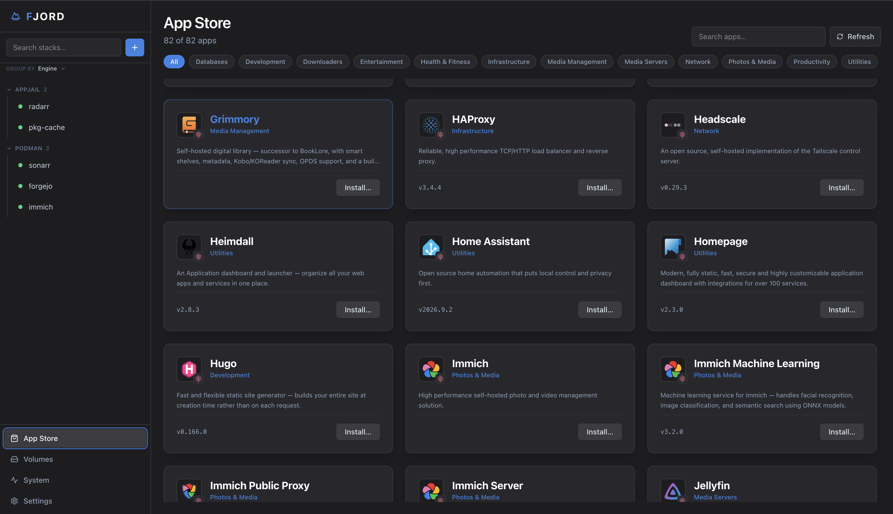
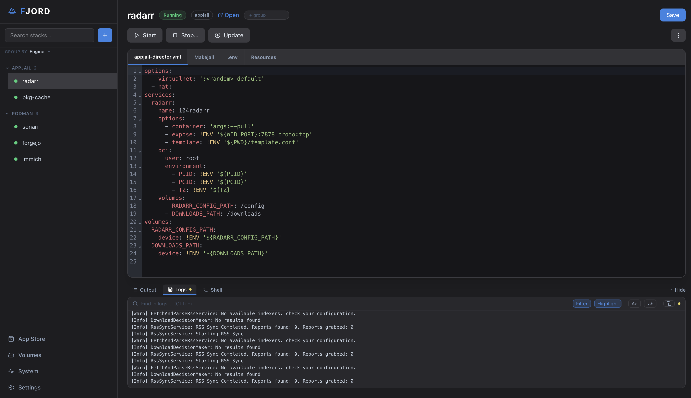
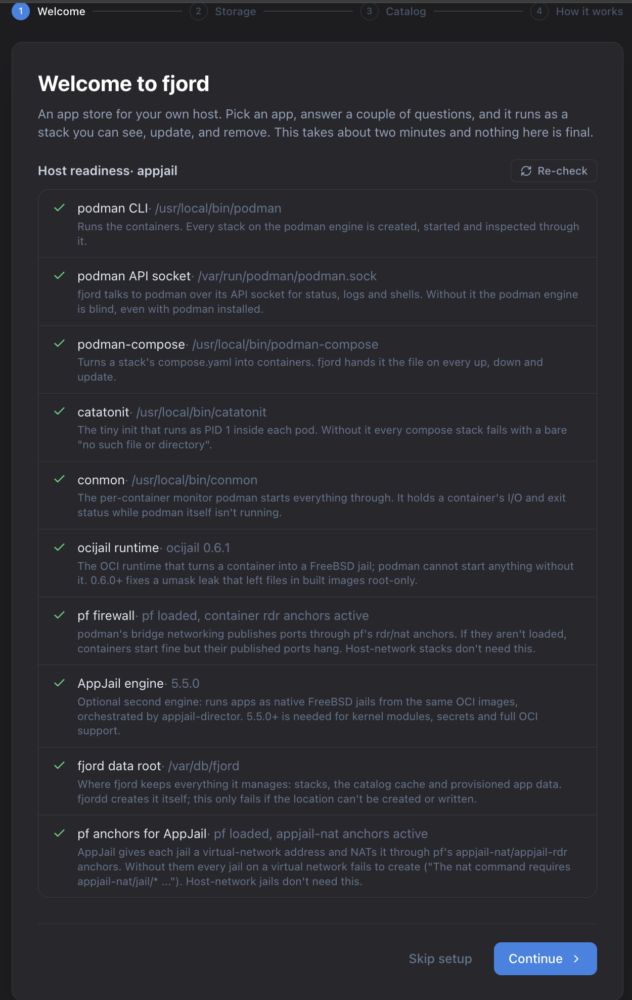

# Operating Guide

fjord organizes container infrastructure operations into five primary functional areas: **App Store**, **Stacks**, **Volumes**, **System**, and **Settings**.

---

## 1. Deploying Stacks via the App Store

{ .glightbox }

The **App Store** catalogs all container applications available across your configured repositories.

### Architecture Filtering
Applications incompatible with your host CPU architecture (`amd64` or `arm64`) are automatically hidden from the primary catalog view. A counter indicates how many applications are hidden, with a toggle to inspect them for reference.

### The Deployment Wizard
Selecting an application opens the deployment wizard, which prompts only for required host bindings:

- **Storage Mounts**: Application data paths and persistent data folders. If you have defined Folder Sets (e.g. `Media` or `Downloads`), use the **Add folder set…** dropdown to auto-fill host paths with a single selection.
- **Port Allocation**: Host-to-container port mappings. Optional auxiliary ports can be disabled or left blank to omit them from the generated specification.
- **Release Channel**: Select between `latest` (upstream releases), `pkg` (FreeBSD Quarterly), or `pkg-latest` (FreeBSD Latest).
- **Engine Selection**: Choose whether the stack should be provisioned via `podman` or `appjail`.

Before starting the container, fjord executes an automated **pre-flight verification**. If a published port is already held by another container, fjord names it; a port held by a host process is reported as in use. The stack configuration is safely written to disk without launching, enabling you to adjust the port binding or terminate the conflicting process.

---

## 2. Stack Lifecycle Management

{ .glightbox }

The **Stacks** view lists all active and stopped applications on the host, indicating their engine backend, running state, and update availability.

### Lifecycle Actions
- **Start / Stop / Restart**: Dispatches orchestration commands to `podman-compose` or `appjail-director`.
- **Update**: Fetches the newest container image for the stack's configured release channel and recreates the container or jail.
- **Pin Version**: Locks the stack to a specific container digest or tag, preventing automated updates from overwriting tested images.
- **Open App**: Opens the primary application web interface in a new browser tab.

### Interactive Diagnostics Drawer
The bottom drawer provides three diagnostic views:

1. **Output**: Live standard output and error streams from the underlying engine commands (`podman-compose up`, `appjail-director up`, etc.).
2. **Logs**: Real-time container log streaming from the Libpod socket or the jail's log.
3. **Shell**: An interactive web terminal connected directly into the running container or jail environment for immediate debugging.

---

## 3. Direct Specification Editing

fjord treats the files on disk as the ultimate ground truth. Every stack page has an integrated CodeMirror editor with syntax highlighting, one tab per file:

- **Compose Specification**: Direct access to `compose.yaml` (Podman stacks) or `appjail-director.yml` + `Makejail` (AppJail stacks).
- **Environment Configuration**: Key-value pairs stored in `.env`.
- **Resources**: A structured form view displaying configured mounts and ports. Modifying a volume mount or port here immediately updates the underlying configuration files.

When you click **Apply**, fjord saves the edited files to disk in `/var/db/fjord/stacks/<id>/` and instructs the engine to reconcile running containers against the new configuration.

---

## 4. Volume &amp; Storage Provisioning

The **Volumes** dashboard manages named storage volumes independently of specific stacks.

- **Local**: Named volumes on the engine's own storage.
- **Remote**: `nfs://server/export` and `smb://user@server/share` (SMB on Linux hosts only) mapped as named container volumes.
- **Safety**: Deleting a volume a stack still uses is refused unless you force it.

---

## 5. System Health &amp; Diagnostics

{ .glightbox }

The **System** dashboard checks the underlying FreeBSD host on every visit and on **Re-check**:

### Readiness Audits
Checks the Libpod API socket (`podman.sock`), Packet Filter anchors (`cni-rdr` and `appjail-nat`), container monitors (`conmon`), and runtime binaries (`ocijail`). Each check displays its operational status, technical significance, and a copyable shell fix command.

### Storage Reclamation
Inspects the total disk space utilized by container layers, base images, and temporary build caches across Podman and AppJail. The **Cleanup** function safely prunes orphaned layers without impacting running stacks or base jail dependencies.

---

## 6. Settings &amp; Customization

- **App Data Directories**: Configure the default filesystem locations or ZFS pools where application state directories are provisioned.
- **Folder Sets**: Define reusable groups of host directories (e.g. Media, Photos, Backups) that can be mapped into any application with one click.
- **Catalogs**: Add private or third-party catalog URLs. fjord merges all active catalogs into the App Store.
- **Default Engine**: Set the preferred container backend (`podman` or `appjail`) for new deployments.
